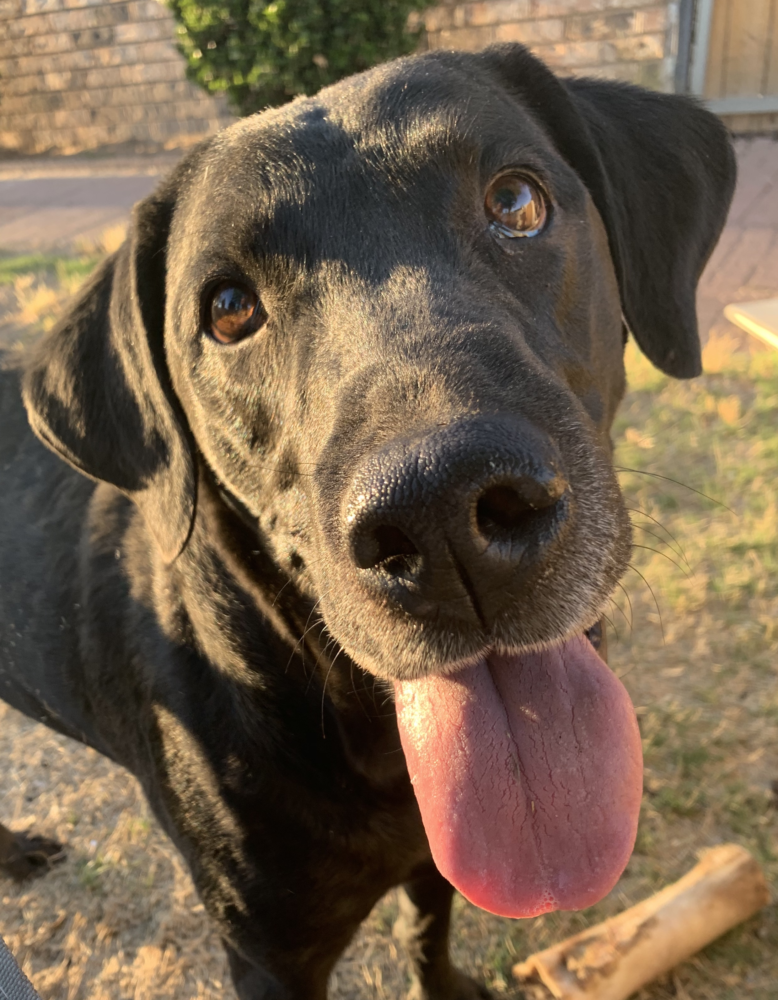

---
---

<link rel="stylesheet" href="styles.css" type="text/css">

Hello, you. I'm Steve, formerly a PhD student at Kansas State University. Currently, I am an assitant professor with the Department of Agricultural Economics and Agricultural Business at New Mexico State University. If you desire more information about the professional-me, you can find my CV [here](files/CV.pdf). I am still new-ish to R and more newish to Git and GitHub, and this website is basically an outgrowth of my attempts at expanding these skills.

**IMPORTANT:** Here is a picture of my dog, Kota. She's super.

